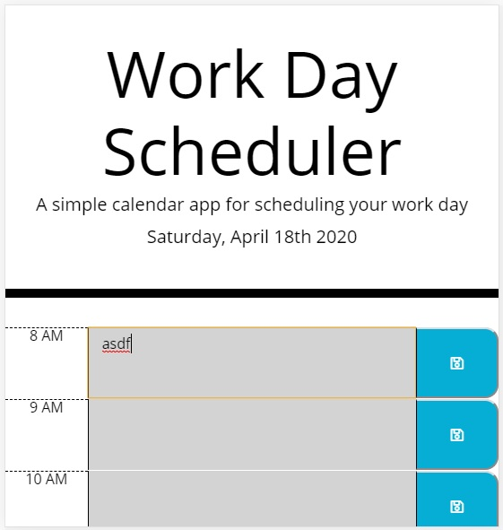

# Work Day Scheduler

## Description
* Work Day Scheduler is programmed to allow the user to enter items in time slots for recurring events throughout the week
  * The current date is displayed at the top of the scheduler
  * There are editable blocks for standard business hours
  * The time blocks are color-coded
    * Gray - past
    * Red - present
    * Green - future
  * The time blocks are editable
    * Click in the color-coded area to the right of the time
    * Type in a new description, or change an existing one
    * Click the save button to store the information to the local storage of the browser
  * When you refresh the screen, the events will persist
    * One caveat is that if you have your browser set to delete its history on exit, this will clear the local storage.
  * This version of the work-scheduler compensates for smaller screens such as those on mobile phones

## URLs
* Github Repo:  [link to Github](https://github.com/feuerbacherb/work-scheduler)
* Active Site:  [link to work-scheduler](https://feuerbacherb.github.io/work-scheduler/)

## Image
* 